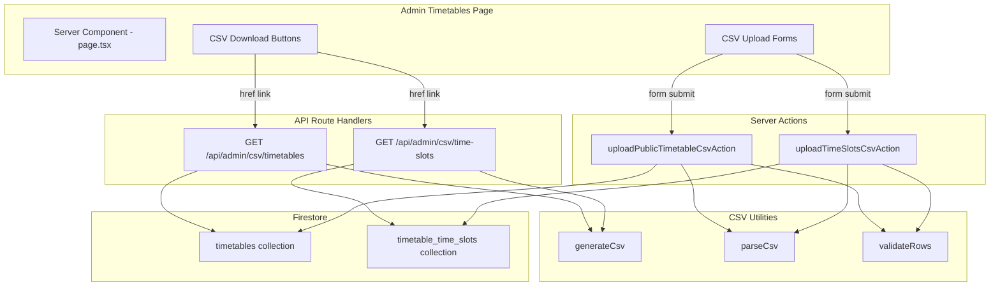
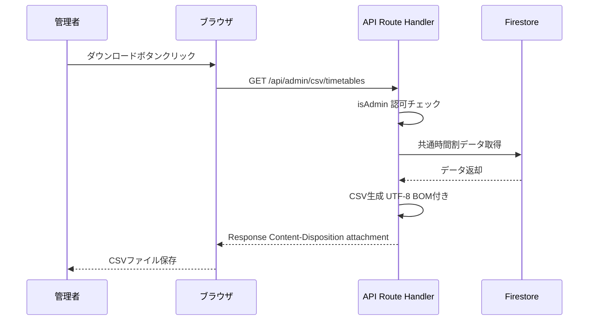
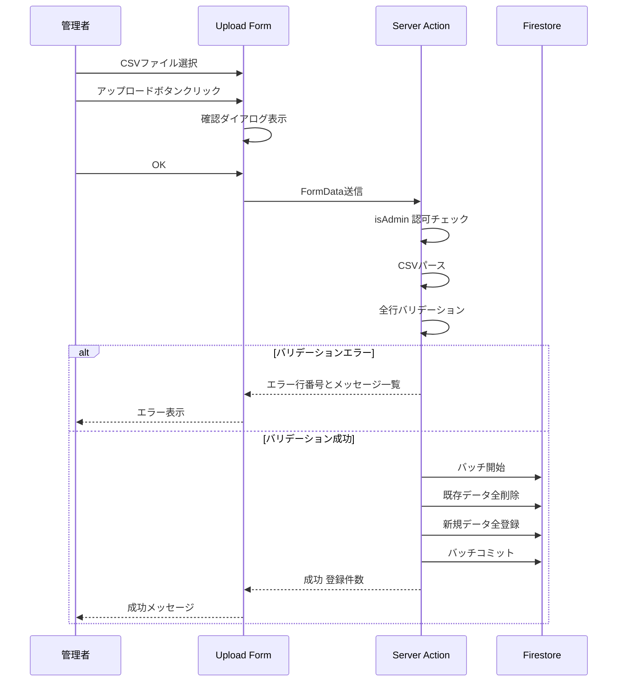

# Design Document

## Overview

**Purpose**: 管理者がCSVファイルを通じて共通時間割と時間帯マスターデータを一括管理できる機能を提供する。
**Users**: 管理者が `/admin/timetables` ページでCSVダウンロード（エクスポート）とCSVアップロード（一括上書きインポート）を行う。
**Impact**: 既存の管理者時間割ページにCSV操作UIとバックエンドAPIを追加する。既存の手動フォーム入力機能は維持する。

### Goals
- 共通時間割と時間帯マスターのCSVダウンロード
- CSVアップロードによる一括上書き登録（既存データ全削除→再登録）
- UTF-8 BOM付きCSVで日本語環境のExcel互換性確保
- バリデーションエラー時の全件ロールバックとエラー表示

### Non-Goals
- 個人時間割（`is_public=false`）のCSV対応
- メンバーデータやイベントデータのCSV対応
- CSVの差分更新（追加のみ・部分削除）
- CSVテンプレートファイルの提供機能

## Architecture

### Existing Architecture Analysis
- 管理者ページ (`/app/admin/timetables/page.tsx`) はServer Componentで、`_data.ts`からデータフェッチ
- データ操作は Server Actions (`/app/actions/timetables.ts`) で実装、`isAdmin()` で認可チェック
- Firestoreに直接アクセス（`getDb()`経由）
- UIコンポーネントは `/components/admin/` に配置

### Architecture Pattern & Boundary Map



**Architecture Integration**:
- 選択パターン: ダウンロードはAPI Route Handler、アップロードはServer Action（`research.md`参照）
- 既存パターン保持: Server Actions + Firestore直接アクセス + `isAdmin()` 認可チェック
- 新規コンポーネント: CSVユーティリティ関数（生成・解析・バリデーション）、CSVダウンロードAPI、CSVアップロードUI

### Technology Stack

| Layer | Choice / Version | Role in Feature | Notes |
|-------|------------------|-----------------|-------|
| Frontend | Next.js 15, React 19 | CSVアップロードフォーム、ダウンロードボタン | Client Component |
| Backend | Next.js Route Handlers, Server Actions | CSVダウンロードAPI、アップロード処理 | 既存パターン踏襲 |
| Data | Firebase/Firestore | 時間割・時間帯マスターの読み書き | バッチ操作使用 |
| Infrastructure | Vercel | ホスティング | ファイルサイズ制限考慮 |

## System Flows

### CSVダウンロードフロー



### CSVアップロードフロー



## Requirements Traceability

| Requirement | Summary | Components | Interfaces | Flows |
|-------------|---------|------------|------------|-------|
| 1.1 | 共通時間割CSVダウンロード | TimetableCsvDownloadButton, timetables CSV route | GET /api/admin/csv/timetables | CSVダウンロードフロー |
| 1.2 | UTF-8 BOM出力 | generateCsv | - | - |
| 1.3 | ダウンロードCSVカラム定義 | timetables CSV route | - | - |
| 1.4 | ファイル名に日付 | timetables CSV route | - | - |
| 1.5 | 0件時ヘッダーのみ | timetables CSV route | - | - |
| 2.1 | 時間帯マスターCSVダウンロード | TimeSlotCsvDownloadButton, time-slots CSV route | GET /api/admin/csv/time-slots | CSVダウンロードフロー |
| 2.2-2.5 | 時間帯マスターDL仕様 | time-slots CSV route, generateCsv | - | - |
| 3.1 | 共通時間割CSV一括上書き | TimetableCsvUploadForm, uploadPublicTimetableCsvAction | Server Action | CSVアップロードフロー |
| 3.2 | アップロード確認ダイアログ | TimetableCsvUploadForm | - | - |
| 3.3 | CSVバリデーション | validateTimetableRows | - | - |
| 3.4 | エラー時ロールバック | uploadPublicTimetableCsvAction | - | - |
| 3.5 | 成功時件数表示 | TimetableCsvUploadForm | - | - |
| 3.6 | DLと同一フォーマット | CSVカラム定義定数 | - | - |
| 4.1-4.6 | 時間帯マスターCSVアップロード | TimeSlotCsvUploadForm, uploadTimeSlotsCsvAction | Server Action | CSVアップロードフロー |
| 5.1-5.5 | CSVフォーマット仕様 | generateCsv, parseCsv | - | - |
| 6.1-6.3 | 認可制御 | 全API Route, 全Server Action | isAdmin | - |
| 7.1-7.5 | エラーハンドリング | 全Upload Form, 全Server Action | - | - |

## Components and Interfaces

| Component | Domain/Layer | Intent | Req Coverage | Key Dependencies | Contracts |
|-----------|-------------|--------|--------------|------------------|-----------|
| CSV Utility Functions | lib/Utility | CSV生成・解析・バリデーション | 5.1-5.5 | なし | Service |
| Timetable CSV Route | API/Backend | 共通時間割CSVダウンロード | 1.1-1.5, 6.1-6.2 | Firestore, isAdmin (P0) | API |
| TimeSlot CSV Route | API/Backend | 時間帯マスターCSVダウンロード | 2.1-2.5, 6.1-6.2 | Firestore, isAdmin (P0) | API |
| uploadPublicTimetableCsvAction | Actions/Backend | 共通時間割CSVアップロード | 3.1-3.6, 6.1-6.2, 7.1-7.5 | Firestore, isAdmin, CSV Utils (P0) | Service |
| uploadTimeSlotsCsvAction | Actions/Backend | 時間帯マスターCSVアップロード | 4.1-4.6, 6.1-6.2, 7.1-7.5 | Firestore, isAdmin, CSV Utils (P0) | Service |
| TimetableCsvUploadForm | UI/Presentation | 共通時間割CSVアップロードUI | 3.1-3.2, 3.5, 7.1-7.5 | uploadPublicTimetableCsvAction (P0) | State |
| TimeSlotCsvUploadForm | UI/Presentation | 時間帯マスターCSVアップロードUI | 4.1-4.2, 4.5, 7.1-7.5 | uploadTimeSlotsCsvAction (P0) | State |
| TimetableCsvDownloadButton | UI/Presentation | 共通時間割CSVダウンロードボタン | 1.1 | API Route (P0) | - |
| TimeSlotCsvDownloadButton | UI/Presentation | 時間帯マスターCSVダウンロードボタン | 2.1 | API Route (P0) | - |

### Utility Layer

#### CSV Utility Functions

| Field | Detail |
|-------|--------|
| Intent | CSV文字列の生成・解析・バリデーションを行う共通ユーティリティ |
| Requirements | 5.1, 5.2, 5.3, 5.4, 5.5 |

**Responsibilities & Constraints**
- CSV文字列の生成（UTF-8 BOM付き）
- CSV文字列の解析（BOM除去、ヘッダー行解析、データ行パース）
- フィールド値のエスケープ（カンマ・ダブルクォート・改行含有時）

**Contracts**: Service [x]

##### Service Interface
```typescript
/** CSVカラム定義 */
interface CsvColumnDef<T> {
  readonly header: string;
  readonly accessor: (row: T) => string | number | boolean;
}

/** CSVパース結果 */
interface CsvParseResult {
  readonly headers: string[];
  readonly rows: string[][];
}

/** CSV生成: データ配列からUTF-8 BOM付きCSV文字列を生成 */
function generateCsv<T>(
  columns: readonly CsvColumnDef<T>[],
  data: readonly T[]
): string;

/** CSVパース: CSV文字列をヘッダーとデータ行に分解 */
function parseCsv(csvText: string): CsvParseResult;

/** ヘッダー検証: 期待するヘッダーと一致するか確認 */
function validateCsvHeaders(
  actual: string[],
  expected: string[]
): { valid: boolean; message?: string };
```

### Backend Layer

#### Timetable CSV Download Route

| Field | Detail |
|-------|--------|
| Intent | 共通時間割データをCSVファイルとしてダウンロードさせるAPI |
| Requirements | 1.1, 1.2, 1.3, 1.4, 1.5, 6.1, 6.2 |

**Contracts**: API [x]

##### API Contract
| Method | Endpoint | Request | Response | Errors |
|--------|----------|---------|----------|--------|
| GET | /api/admin/csv/timetables | なし | CSV file (Content-Disposition: attachment) | 403 Forbidden |

**Implementation Notes**
- `isAdmin()` で認可チェック、非管理者は403
- `getPublicTimetables()` を再利用してデータ取得
- CSVカラム: 学年, 専攻, 曜日, 時限, 教科名, 教室, 担当講師
- 曜日は数値（0=日〜6=土）をCSV上は日本語表記（月, 火, ...）に変換
- ファイル名: `timetables_YYYY-MM-DD.csv`

#### TimeSlot CSV Download Route

| Field | Detail |
|-------|--------|
| Intent | 時間帯マスターデータをCSVファイルとしてダウンロードさせるAPI |
| Requirements | 2.1, 2.2, 2.3, 2.4, 2.5, 6.1, 6.2 |

**Contracts**: API [x]

##### API Contract
| Method | Endpoint | Request | Response | Errors |
|--------|----------|---------|----------|--------|
| GET | /api/admin/csv/time-slots | なし | CSV file (Content-Disposition: attachment) | 403 Forbidden |

**Implementation Notes**
- CSVカラム: 時限, ラベル, 開始時刻, 終了時刻, 有効
- 「有効」カラムは `true`/`false` 文字列
- ファイル名: `time_slots_YYYY-MM-DD.csv`

#### uploadPublicTimetableCsvAction

| Field | Detail |
|-------|--------|
| Intent | CSVファイルから共通時間割データを一括上書き登録するServer Action |
| Requirements | 3.1, 3.2, 3.3, 3.4, 3.5, 3.6, 6.1, 6.2, 7.1, 7.2, 7.5 |

**Contracts**: Service [x]

##### Service Interface
```typescript
interface CsvUploadState {
  readonly error: string | null;
  readonly errors: readonly CsvRowError[] | null;
  readonly success: string | null;
}

interface CsvRowError {
  readonly row: number;
  readonly message: string;
}

function uploadPublicTimetableCsvAction(
  prevState: CsvUploadState,
  formData: FormData
): Promise<CsvUploadState>;
```

**Implementation Notes**
- バリデーション: 学年(1-4), 曜日(月-土の日本語→数値変換), 時限(1-10), 教科名(必須), 専攻(departmentOptionsに含まれること)
- Firestoreバッチで `is_public=true` の全ドキュメント削除→新規ドキュメント追加
- 時間帯マスターから `time_slot_id` を時限番号で逆引きして設定
- エラー時: バッチをコミットせず、エラー行リストを返却

#### uploadTimeSlotsCsvAction

| Field | Detail |
|-------|--------|
| Intent | CSVファイルから時間帯マスターデータを一括上書き登録するServer Action |
| Requirements | 4.1, 4.2, 4.3, 4.4, 4.5, 4.6, 6.1, 6.2, 7.1, 7.2, 7.5 |

**Contracts**: Service [x]

##### Service Interface
```typescript
function uploadTimeSlotsCsvAction(
  prevState: CsvUploadState,
  formData: FormData
): Promise<CsvUploadState>;
```

**Implementation Notes**
- バリデーション: 時限(1-10, 数値), 開始時刻・終了時刻(HH:MM形式), 開始<終了, ラベル(必須)
- 「有効」カラム: `true`/`false`/`1`/`0` を許容
- Firestoreバッチで `timetable_time_slots` の全ドキュメント削除→新規追加

### Presentation Layer

#### TimetableCsvUploadForm

| Field | Detail |
|-------|--------|
| Intent | 共通時間割CSVアップロード用のクライアントコンポーネント |
| Requirements | 3.1, 3.2, 3.5, 7.1, 7.3, 7.4 |

**Contracts**: State [x]

##### State Management
- `useActionState` で `uploadPublicTimetableCsvAction` をバインド
- ファイル選択状態、ローディング状態、エラー/成功メッセージをローカルstateで管理
- アップロードボタンクリック時に `window.confirm()` で確認ダイアログ表示
- `.csv` ファイルのみ受付（`accept=".csv"`）

#### TimeSlotCsvUploadForm

| Field | Detail |
|-------|--------|
| Intent | 時間帯マスターCSVアップロード用のクライアントコンポーネント |
| Requirements | 4.1, 4.2, 4.5, 7.1, 7.3, 7.4 |

**Implementation Notes**: TimetableCsvUploadFormと同構造。Server Actionのみ異なる。

#### TimetableCsvDownloadButton / TimeSlotCsvDownloadButton

| Field | Detail |
|-------|--------|
| Intent | CSVダウンロードを起動するリンクボタン |
| Requirements | 1.1, 2.1 |

**Implementation Notes**: `<a href="/api/admin/csv/..." download>` リンクで実装。Server Componentとして配置可能。

## Data Models

### CSVカラム定義

**共通時間割CSV**:
| CSVヘッダー | Firestoreフィールド | 型 | 必須 | バリデーション |
|---|---|---|---|---|
| 学年 | grade | number | Yes | 1-4 |
| 専攻 | major | string | Yes | departmentOptionsに含まれること |
| 曜日 | day_of_week | number (CSV上は日本語) | Yes | 月〜土（CSVでは日本語、DB上は0-6） |
| 時限 | period | number | Yes | 1-10 |
| 教科名 | course_name | string | Yes | 空でないこと |
| 教室 | classroom | string | No | - |
| 担当講師 | instructor | string | No | - |

**時間帯マスターCSV**:
| CSVヘッダー | Firestoreフィールド | 型 | 必須 | バリデーション |
|---|---|---|---|---|
| 時限 | period | number | Yes | 1-10 |
| ラベル | label | string | Yes | 空でないこと |
| 開始時刻 | start_time | string | Yes | HH:MM形式 |
| 終了時刻 | end_time | string | Yes | HH:MM形式、開始時刻より後 |
| 有効 | is_active | boolean | Yes | true/false/1/0 |

### Physical Data Model

既存のFirestoreコレクション構造をそのまま使用。新規コレクションの追加なし。

**timetables collection** (既存):
- CSVアップロード時に `is_public=true` のドキュメントのみを対象に一括上書き
- `member_id=null`, `is_public=true`, `year=現在年`, `semester=null` を固定値として設定

**timetable_time_slots collection** (既存):
- CSVアップロード時に全ドキュメントを対象に一括上書き

## Error Handling

### Error Strategy
バリデーションファースト: CSVの全行を検証してからFirestoreバッチ操作を実行。1行でもエラーがあれば全体をリジェクト。

### Error Categories and Responses

**ファイル形式エラー** (クライアント側):
- CSVでないファイル → 「CSVファイルを選択してください」
- `accept=".csv"` でHTMLレベルでもフィルタリング

**ヘッダーエラー** (サーバー側):
- 期待するカラムと不一致 → 期待カラム名を含むエラーメッセージ

**行バリデーションエラー** (サーバー側):
- 各行のエラーを `CsvRowError[]` として返却
- 行番号（ヘッダー除く1始まり）とエラー内容を表示

**サーバーエラー** (Firestoreバッチ失敗):
- エラーメッセージを返却、データは変更されない（バッチ未コミット）

## Testing Strategy

### Unit Tests
- `generateCsv`: BOM付きCSV文字列の生成、空データ時のヘッダーのみ出力
- `parseCsv`: BOM除去、ヘッダー解析、ダブルクォート対応
- `validateCsvHeaders`: ヘッダー一致/不一致
- 共通時間割バリデーション: 学年・曜日・時限の範囲チェック、専攻名の妥当性
- 時間帯マスターバリデーション: 時刻フォーマット、開始<終了チェック

### Integration Tests
- CSVダウンロードAPI: 認可チェック、レスポンスヘッダー、CSVコンテンツ
- CSVアップロードAction: 正常系（一括上書き確認）、異常系（バリデーションエラー時のロールバック）
- Firestoreバッチ操作: 全削除→全登録のアトミック性
