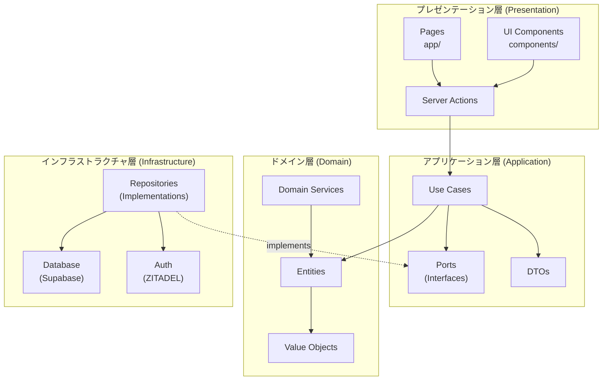
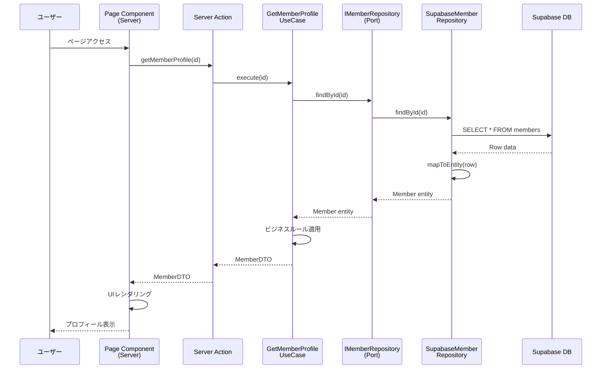
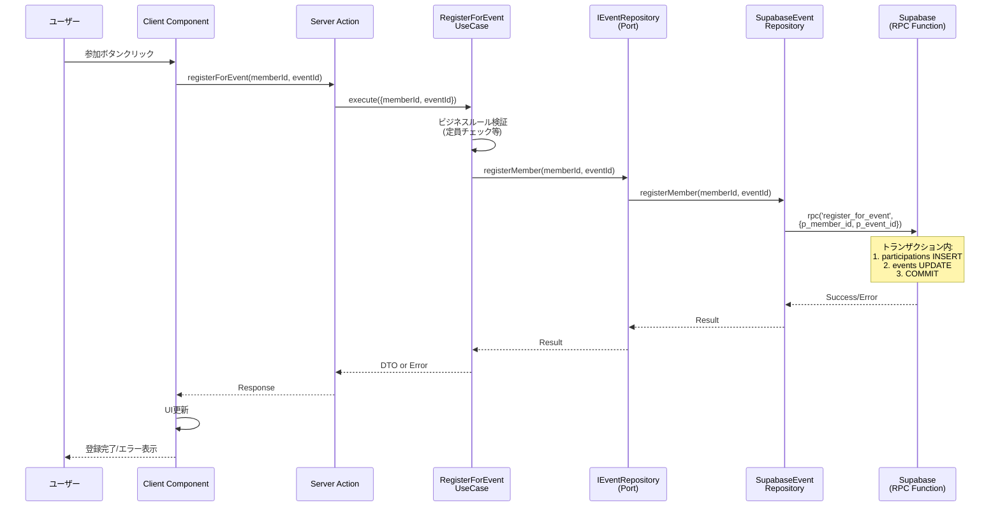
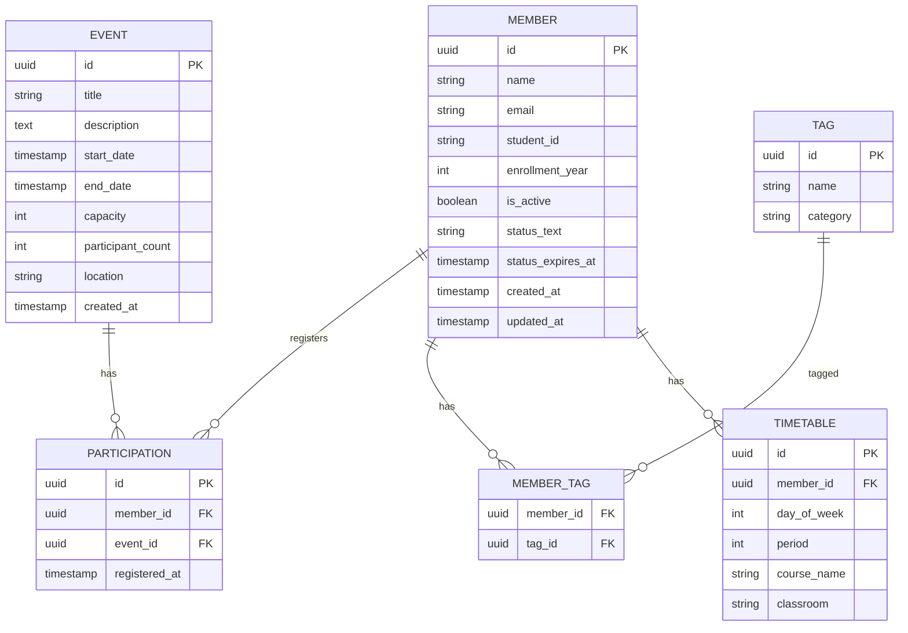
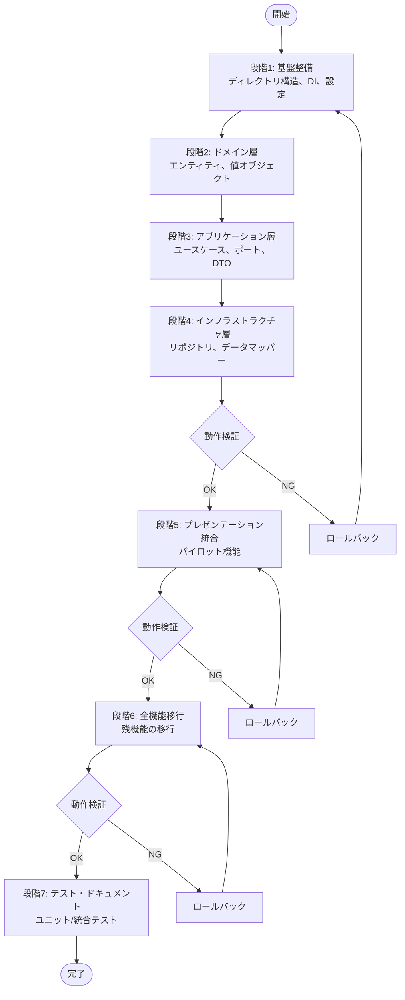

# 技術設計書: Clean Architecture リファクタリング

## 概要

本設計は、Portal.Cを標準的なNext.jsアーキテクチャからClean Architectureへリファクタリングするための技術的アプローチを定義します。このリファクタリングにより、レイヤーの適切な分離、テスタビリティの向上、保守性の改善を実現しながら、既存のすべての機能を維持します。

Portal.Cは、Tech.C Venture向けのメンバー・イベント管理Webアプリケーションであり、現在Next.js 15、Supabase、ZITADELを使用しています。現在の構造（app/, components/, lib/, types/）から、ドメイン駆動設計の原則に基づいた明確なレイヤー構造（src/domain/, src/application/, src/infrastructure/, src/presentation/）へ移行します。

**ユーザー**: 開発チーム、Tech.C Ventureのメンバーと管理者

**影響**: 既存のコードベース構造を根本的に変更しますが、ユーザー向け機能は完全に維持されます。開発者体験は、明確なレイヤー分離とテスト可能性の向上により大幅に改善されます。

### 目標

- **レイヤー分離の実現**: Domain、Application、Infrastructure、Presentationの4層を明確に分離し、Clean Architectureの依存性ルールを遵守
- **テスタビリティの向上**: ビジネスロジックとインフラストラクチャロジックを独立してテスト可能にする環境を構築
- **既存機能の保持**: リファクタリング後もすべての既存機能（メンバー管理、イベント管理、タイムテーブル、認証）が正常に動作
- **段階的移行**: 7段階の移行計画により、リスクを最小化しながら安全にリファクタリングを実施
- **開発者体験の改善**: 明確なアーキテクチャパターンとドキュメントにより、新しい開発者のオンボーディングと機能追加を容易化

### 非目標

- **機能追加**: 本リファクタリングは既存機能の再構築のみを対象とし、新機能追加は含まない
- **UIデザインの変更**: Spindle UIコンポーネントとデザインシステムはそのまま維持
- **データベーススキーマの変更**: 既存のSupabaseスキーマは変更せず、そのまま活用
- **認証システムの変更**: ZITADELとNextAuth.jsの統合はそのまま維持
- **パフォーマンス最適化**: アーキテクチャ変更に伴う自然な改善は期待されるが、積極的な最適化は別途実施

## アーキテクチャ

### 既存アーキテクチャ分析

**現在のパターン**
- **標準的なNext.js構造**: app/ディレクトリによるファイルベースルーティング
- **直接的なデータアクセス**: UIコンポーネントから直接Supabaseクライアントを呼び出す想定（現在はモックデータ）
- **型定義とビジネスロジックの混在**: types/index.tsに`calculateGrade()`, `isStatusValid()`などのビジネスロジックが含まれる
- **レイヤー分離なし**: プレゼンテーション、ビジネスロジック、データアクセスが明確に分離されていない

**再利用可能な資産**
- ✅ **データベーススキーマ完全構築済み**: members, tags, events, timetablesテーブル、RLS設定済み
- ✅ **認証基盤設定完了**: ZITADEL OIDC統合、NextAuth.js設定、ロールベースアクセス制御
- ✅ **Supabaseクライアント**: 4種類のクライアント（browser, server, admin, middleware）
- ✅ **型定義システム**: Supabase自動生成型、アプリケーション型
- ✅ **UIコンポーネント**: Spindle UI統合、ページコンポーネント実装済み

**技術的制約**
- Next.js 15 App Routerの使用が必須
- Supabaseをデータベースとして使用
- ZITADELを認証基盤として使用
- TypeScript strict mode有効

### アーキテクチャパターンと境界マップ

**選択パターン**: Clean Architecture（4層モデル）

**根拠**:
- ドメインロジックとインフラストラクチャの明確な分離
- 依存性逆転の原則により、ビジネスロジックが外部技術に依存しない
- テスタビリティと保守性の大幅な向上
- Next.js 15 App Routerとの互換性が高い（調査により実証済み）



**ドメイン/機能境界**:
- **Member管理**: プロフィール、学年計算、ステータス管理、スキル/興味タグ
- **Event管理**: イベント作成、参加登録、定員管理、参加追跡
- **Timetable管理**: 時間割表示、学年/学部フィルタリング
- **認証・認可**: ZITADEL統合、ロールベースアクセス制御

**既存パターンの保持**:
- Next.js 15 App Routerのファイルベースルーティング（app/ディレクトリ）
- Spindle UIコンポーネントライブラリ
- Tailwind CSSスタイリング
- Supabaseデータベーススキーマ

**新規コンポーネントの根拠**:
- **Domain層**: 外部依存のないビジネスロジックのカプセル化
- **Application層**: ユースケース駆動の開発と依存性逆転の実現
- **Infrastructure層**: 外部サービスとの統合を抽象化し、テスト可能性を向上
- **Presentation層の分離**: UIロジックとビジネスロジックの明確な分離

**Steering準拠**:
- TypeScript strict mode有効（Type Safety）
- Clean Architectureへの移行（tech.mdで明記）
- 既存の技術スタック保持（Next.js 15, Supabase, ZITADEL）
- ドメイン駆動設計の原則に基づいたレイヤー構造（structure.md）

### 技術スタック

| レイヤー | 選択/バージョン | 本機能での役割 | 備考 |
|---------|---------------|--------------|------|
| **Language** | TypeScript 5.6+ | 全レイヤーで型安全性を確保 | strict mode有効、`any`型禁止 |
| **Framework** | Next.js 15 (App Router) | プレゼンテーション層のフレームワーク | Server Components/Client Components、Server Actions |
| **Runtime** | Node.js 18+ | サーバーサイド実行環境 | Edge Functionsサポート |
| **Database** | Supabase (PostgreSQL) | データ永続化 | RLS設定済み、型自動生成 |
| **ORM/Client** | @supabase/supabase-js | インフラストラクチャ層でのデータアクセス | リポジトリパターン実装の基盤 |
| **Authentication** | ZITADEL via NextAuth.js 4.24 | 認証・認可 | OIDC統合、ロールベース制御 |
| **Dependency Injection** | 軽量ファクトリーパターン | アプリケーション層とインフラ層の接続 | ioctopus風のインターフェースバインディング |
| **Styling** | Tailwind CSS 3.4 | UIスタイリング | 既存スタイル保持 |
| **UI Components** | @openameba/spindle-ui 3.1.4 | UIコンポーネントライブラリ | 既存コンポーネント保持 |
| **Testing** | Jest または Vitest（段階7で決定） | ユニット/統合テスト | Next.js 15互換性を考慮 |

**技術選択の根拠**:
- **軽量DIパターン**: reflect-metadata不要でNext.js Server Componentsと互換性が高い（[調査](https://dev.to/behnamrhp/how-we-fixed-nextjs-at-scale-di-clean-architecture-secrets-from-production-gnj)により実証）
- **Supabase継続**: トランザクション処理はPostgreSQL関数+RPC経由で実現可能（[公式ガイド](https://marmelab.com/blog/2025/12/08/supabase-edge-function-transaction-rls.html)）
- **既存スタック保持**: データベーススキーマ、認証、UIコンポーネントは再利用可能な資産

詳細な調査結果は`research.md`を参照。

## システムフロー

### メンバープロフィール取得フロー



**フロー決定事項**:
- Server ComponentsがデフォルトでServer Actionsを呼び出す
- UseCaseがビジネスロジックを集約
- リポジトリがDB型→ドメインエンティティへの変換を担当
- DTOでレイヤー間のデータ転送を実施

### イベント参加登録フロー（トランザクション）



**フロー決定事項**:
- トランザクション処理はPostgreSQL関数をRPC経由で呼び出す（[Supabase公式パターン](https://marmelab.com/blog/2025/12/08/supabase-edge-function-transaction-rls.html)）
- PostgRESTが自動的にrpc()をトランザクションでラップ
- ビジネスルール検証はUseCaseで実施（定員チェック等）
- エラーハンドリングはレイヤー間で標準化されたResult型を使用

## 要件トレーサビリティ

| 要件 | 概要 | コンポーネント | インターフェース | フロー |
|------|------|--------------|----------------|--------|
| 1.1 | src/ディレクトリ作成 | ディレクトリ構造 | - | - |
| 1.2 | domain/等4層作成 | Domain, Application, Infrastructure, Presentation | - | - |
| 1.3 | 機能別サブディレクトリ | entities/, use-cases/, repositories/ | - | - |
| 1.4 | app/ディレクトリ保持 | Pages (app/) | - | - |
| 1.5 | components/保持 | UI Components | BaseUIProps | - |
| 1.6 | lib/,types/移行 | 全レイヤーに分散 | - | - |
| 1.7 | tsconfig.jsonパスエイリアス | - | - | - |
| 2.1 | エンティティ定義 | Member, Event, Timetable | Entity interfaces | - |
| 2.2 | 外部依存なし実装 | Domain層全体 | - | - |
| 2.3 | 値オブジェクト | Email, StudentId, EventCapacity | ValueObject interfaces | - |
| 2.4 | イミュータビリティ | 値オブジェクト | - | - |
| 2.5 | ドメインサービス | GradeCalculator（必要時） | DomainService interfaces | - |
| 2.6 | レイヤー依存ルール | 依存性注入メカニズム | - | - |
| 2.7 | バリデーション実行 | Entity constructor/methods | - | - |
| 3.1 | ユースケースクラス | GetMemberProfile, RegisterForEvent等 | IUseCase | プロフィール取得、イベント登録 |
| 3.2 | execute()メソッド | 全ユースケース | IUseCase.execute() | - |
| 3.3 | ポートインターフェース | IMemberRepository, IEventRepository等 | Repository interfaces | - |
| 3.4 | DTO定義 | MemberDTO, EventDTO等 | DTO interfaces | 全フロー |
| 3.5 | Domain層のみ依存 | Application層 | - | - |
| 3.6 | ポート経由呼び出し | ユースケース→リポジトリ | - | 全フロー |
| 3.7 | エラースロー | ユースケース | DomainError, AppError | - |
| 3.8 | トランザクション境界 | ユースケース | - | イベント登録 |
| 4.1 | リポジトリ実装 | SupabaseMemberRepository等 | IMemberRepository等 | 全フロー |
| 4.2 | ポート実装 | 全リポジトリ | - | - |
| 4.3 | Supabaseクライアント | DatabaseClient | - | - |
| 4.4 | ZITADEL認証 | AuthProvider | IAuthService | - |
| 4.5 | 型変換ロジック | データマッパー | - | - |
| 4.6 | DB型→ドメイン変換 | mapToEntity() | - | プロフィール取得 |
| 4.7 | エラー変換 | リポジトリ | - | - |
| 4.8 | 外部API連携 | （該当なし） | - | - |
| 4.9 | 依存性注入 | DIContainer | - | - |
| 5.1 | app/保持 | Pages | - | - |
| 5.2 | components/保持 | UI Components | - | - |
| 5.3 | サーバーコンポーネント | Page components | - | プロフィール取得 |
| 5.4 | クライアントコンポーネント | Interactive UI | - | イベント登録 |
| 5.5 | ユースケース通信 | Server Actions | - | 全フロー |
| 5.6 | 直接呼び出し禁止 | アーキテクチャルール | - | - |
| 5.7 | ユースケース呼び出し | Server Actions | - | 全フロー |
| 5.8 | エラー表示 | Error UI Components | ErrorDTO | 全フロー |
| 5.9 | Server Actions実装 | Server Actions | - | 全フロー |
| 6.1-6.7 | 依存性ルール | 全レイヤー | - | - |
| 7.1-7.9 | 既存機能保持 | 全機能 | - | - |
| 8.1-8.8 | テスタビリティ | テストフレームワーク、モック | - | - |
| 9.1-9.8 | マイグレーション | 7段階計画 | - | - |
| 10.1-10.7 | ドキュメント | READMEs, ガイド | - | - |

## コンポーネントとインターフェース

### コンポーネント概要

| コンポーネント | ドメイン/レイヤー | 目的 | 要件カバレッジ | 主要依存関係 (優先度) | 契約 |
|--------------|----------------|------|--------------|---------------------|------|
| Member | Domain/Entities | メンバービジネスロジック | 2.1, 2.2, 2.7 | ValueObjects (P0) | State |
| Email, StudentId | Domain/ValueObjects | 値オブジェクト | 2.3, 2.4 | - | State |
| IMemberRepository | Application/Ports | リポジトリインターフェース | 3.3 | Member (P0) | Service |
| GetMemberProfile | Application/UseCases | プロフィール取得ユースケース | 3.1, 3.2, 3.6 | IMemberRepository (P0), Member (P0) | Service |
| RegisterForEvent | Application/UseCases | イベント登録ユースケース | 3.1, 3.2, 3.8 | IEventRepository (P0), Event (P0) | Service |
| MemberDTO | Application/DTOs | データ転送オブジェクト | 3.4 | - | State |
| SupabaseMemberRepository | Infrastructure/Repositories | リポジトリ実装 | 4.1, 4.2, 4.6 | Supabase Client (P0), IMemberRepository (P0) | Service |
| DatabaseClient | Infrastructure/Database | Supabaseクライアント | 4.3 | @supabase/supabase-js (P0) | Service |
| AuthProvider | Infrastructure/Auth | ZITADEL認証プロバイダー | 4.4 | NextAuth.js (P0), ZITADEL (P0) | Service |
| DIContainer | Infrastructure/DI | 依存性注入コンテナ | 4.9 | - | Service |
| MemberProfilePage | Presentation/Pages | メンバープロフィールページ | 5.1, 5.3 | GetMemberProfile (P0), MemberDTO (P0) | - |
| EventRegistrationButton | Presentation/Components | イベント登録ボタン | 5.2, 5.4 | RegisterForEvent (P0) | - |
| Server Actions | Presentation/Actions | Server Actions | 5.5, 5.7, 5.9 | UseCases (P0) | API |

---

### ドメイン層 (Domain Layer)

#### Member Entity

| フィールド | 詳細 |
|-----------|------|
| 目的 | メンバーのビジネスロジックとルールをカプセル化 |
| 要件 | 2.1, 2.2, 2.7 |
| オーナー/レビュアー | 開発チーム |

**責務と制約**
- メンバーの状態管理とバリデーション
- 学年計算ロジック（入学年度から自動計算）
- ステータス有効性チェック（24時間限定）
- 在籍フラグ管理
- ドメイン境界: 単一のメンバーアグリゲート、他のエンティティに依存しない

**依存関係**
- Outbound: Email (値オブジェクト) — メールアドレス検証 (P0)
- Outbound: StudentId (値オブジェクト) — 学籍番号検証 (P0)

**契約**: State [x]

##### State Management

**状態モデル**:
```typescript
interface Member {
  readonly id: string;
  readonly name: string;
  readonly email: Email;
  readonly studentId: StudentId;
  readonly enrollmentYear: number;
  readonly isActive: boolean;
  readonly status?: {
    readonly text: string;
    readonly expiresAt: Date;
  };
  readonly skills: readonly string[];
  readonly interests: readonly string[];
  readonly createdAt: Date;
  readonly updatedAt: Date;

  // ビジネスロジックメソッド
  calculateGrade(currentYear: number, currentMonth: number): number;
  isStatusValid(): boolean;
  updateStatus(text: string): Member;
  deactivate(): Member;
}
```

**永続化と整合性**:
- イミュータブル: すべてのプロパティはreadonlyであり、更新は新しいインスタンスを返す
- 整合性: コンストラクタでバリデーションを実施し、不正な状態を防ぐ

**同時実行戦略**:
- エンティティ自体は状態を持たない（純粋関数型アプローチ）
- 同時実行制御はリポジトリ層で実施（楽観的ロック等）

**実装ノート**
- **統合**: types/index.tsの既存ビジネスロジック（calculateGrade, isStatusValid）を移行
- **バリデーション**: コンストラクタでEmail、StudentIdの値オブジェクトを使用した検証
- **リスク**: イミュータブル実装によるパフォーマンス影響は軽微（調査結果より）

---

#### Email, StudentId (値オブジェクト)

| フィールド | 詳細 |
|-----------|------|
| 目的 | ビジネスルールを持つ値のカプセル化とバリデーション |
| 要件 | 2.3, 2.4 |

**責務と制約**
- 値のバリデーションと不変性の保証
- ビジネスルールの実装（例: メールアドレス形式、学籍番号形式）
- 等価性比較

**契約**: State [x]

##### State Management

**Emailモデル**:
```typescript
interface Email {
  readonly value: string;

  // ファクトリーメソッド
  static create(value: string): Result<Email, ValidationError>;

  // 等価性
  equals(other: Email): boolean;
}
```

**StudentIdモデル**:
```typescript
interface StudentId {
  readonly value: string;

  static create(value: string): Result<StudentId, ValidationError>;
  equals(other: StudentId): boolean;
}
```

**永続化と整合性**:
- イミュータブル: 生成後は変更不可
- バリデーション: ファクトリーメソッドで生成時に検証

**実装ノート**
- **バリデーション**: 正規表現でメールアドレス形式、学籍番号形式を検証
- **リスク**: バリデーションロジックの複雑性は低い

---

### アプリケーション層 (Application Layer)

#### IMemberRepository (ポートインターフェース)

| フィールド | 詳細 |
|-----------|------|
| 目的 | メンバーリポジトリの抽象化インターフェース |
| 要件 | 3.3 |

**責務と制約**
- メンバーエンティティのCRUD操作インターフェースを定義
- トランザクション境界なし（単一エンティティ操作）
- ドメイン境界: Memberアグリゲート

**依存関係**
- Inbound: GetMemberProfile UseCase — プロフィール取得 (P0)
- Inbound: UpdateMemberProfile UseCase — プロフィール更新 (P0)
- Outbound: Member Entity — ビジネスロジック (P0)

**契約**: Service [x]

##### Service Interface

```typescript
interface IMemberRepository {
  findById(id: string): Promise<Result<Member | null, RepositoryError>>;
  findAll(params: QueryParams): Promise<Result<Member[], RepositoryError>>;
  findByEmail(email: Email): Promise<Result<Member | null, RepositoryError>>;
  create(member: Member): Promise<Result<Member, RepositoryError>>;
  update(id: string, member: Partial<Member>): Promise<Result<Member, RepositoryError>>;
  delete(id: string): Promise<Result<void, RepositoryError>>;
}

interface QueryParams {
  limit?: number;
  offset?: number;
  filters?: {
    isActive?: boolean;
    enrollmentYear?: number;
  };
}
```

**事前条件**:
- `findById`, `update`, `delete`: idは有効なUUID形式
- `create`: memberは有効なMemberエンティティ（バリデーション済み）

**事後条件**:
- `findById`: 存在する場合はMemberエンティティ、存在しない場合はnull
- `create`, `update`: 成功時は保存されたMemberエンティティを返す
- `delete`: 成功時はvoid、エンティティは削除される

**不変条件**:
- すべてのメソッドはResult型を返し、エラーハンドリングを明示的に

**実装ノート**
- **統合**: Infrastructure層のSupabaseMemberRepositoryが実装
- **バリデーション**: エンティティレベルで実施済み、リポジトリは永続化のみ
- **リスク**: Supabaseクエリビルダーとの型安全性を確保（TypeScript型生成）

---

#### IEventRepository (ポートインターフェース)

| フィールド | 詳細 |
|-----------|------|
| 目的 | イベントリポジトリの抽象化インターフェース |
| 要件 | 3.3 |

**責務と制約**
- イベントエンティティのCRUD操作インターフェース
- イベント参加登録（トランザクション処理）
- ドメイン境界: Eventアグリゲート、Participationアグリゲート

**依存関係**
- Inbound: RegisterForEvent UseCase — イベント登録 (P0)
- Inbound: GetEventList UseCase — イベント一覧取得 (P0)
- Outbound: Event Entity — ビジネスロジック (P0)

**契約**: Service [x]

##### Service Interface

```typescript
interface IEventRepository {
  findById(id: string): Promise<Result<Event | null, RepositoryError>>;
  findAll(params: EventQueryParams): Promise<Result<Event[], RepositoryError>>;
  create(event: Event): Promise<Result<Event, RepositoryError>>;
  update(id: string, event: Partial<Event>): Promise<Result<Event, RepositoryError>>;
  delete(id: string): Promise<Result<void, RepositoryError>>;

  // トランザクション処理（RPC経由）
  registerMember(memberId: string, eventId: string): Promise<Result<void, RepositoryError>>;
  unregisterMember(memberId: string, eventId: string): Promise<Result<void, RepositoryError>>;

  // 参加者取得
  getParticipants(eventId: string): Promise<Result<Member[], RepositoryError>>;
}

interface EventQueryParams {
  limit?: number;
  offset?: number;
  filters?: {
    startDateFrom?: Date;
    startDateTo?: Date;
  };
}
```

**事前条件**:
- `registerMember`, `unregisterMember`: memberId, eventIdは有効なUUID
- `registerMember`: イベントの定員に空きがある（ビジネスロジックで事前チェック）

**事後条件**:
- `registerMember`: participationsテーブルにレコード追加、eventsのparticipant_count増加（トランザクション）
- `unregisterMember`: participationsテーブルからレコード削除、eventsのparticipant_count減少（トランザクション）

**不変条件**:
- トランザクション処理の原子性を保証（RPC経由でPostgreSQL関数実行）

**実装ノート**
- **統合**: Infrastructure層のSupabaseEventRepositoryが実装
- **バリデーション**: PostgreSQL関数内でビジネスルール検証（定員チェック等）
- **リスク**: RPC関数の型安全性を確保（TypeScript型生成とテスト）

---

#### GetMemberProfile UseCase

| フィールド | 詳細 |
|-----------|------|
| 目的 | メンバープロフィール取得ユースケース |
| 要件 | 3.1, 3.2, 3.6 |

**責務と制約**
- メンバープロフィールの取得とDTOへの変換
- ビジネスルール適用（例: 学年計算、ステータス有効性チェック）
- トランザクション境界: なし（読み取り専用）
- ドメイン境界: Memberアグリゲート

**依存関係**
- Inbound: Server Actions — プレゼンテーション層からの呼び出し (P0)
- Outbound: IMemberRepository — データ取得 (P0)
- Outbound: Member Entity — ビジネスロジック (P0)

**契約**: Service [x]

##### Service Interface

```typescript
interface IUseCase<TInput, TOutput> {
  execute(input: TInput): Promise<Result<TOutput, UseCaseError>>;
}

interface GetMemberProfileUseCase extends IUseCase<GetMemberProfileInput, MemberDTO> {
  execute(input: GetMemberProfileInput): Promise<Result<MemberDTO, UseCaseError>>;
}

interface GetMemberProfileInput {
  memberId: string;
  currentYear: number;
  currentMonth: number;
}
```

**事前条件**:
- memberIdは有効なUUID形式
- currentYear, currentMonthは有効な日付

**事後条件**:
- 成功時: MemberDTOを返す（学年計算済み、ステータス有効性チェック済み）
- 失敗時: MemberNotFoundError または RepositoryError

**不変条件**:
- ビジネスロジックは常にドメインエンティティ内で実行
- DTOはシリアライズ可能な型のみ（Date→ISO文字列等）

**実装ノート**
- **統合**: Server Actionsから呼び出され、リポジトリを通じてデータ取得
- **バリデーション**: エンティティのcalculateGrade(), isStatusValid()を使用
- **リスク**: DTOシリアライゼーションでDate型の扱いに注意

---

#### RegisterForEvent UseCase

| フィールド | 詳細 |
|-----------|------|
| 目的 | イベント参加登録ユースケース |
| 要件 | 3.1, 3.2, 3.8 |

**責務と制約**
- イベント参加登録とビジネスルール検証
- トランザクション境界: 定義あり（participations INSERT + events UPDATE）
- ドメイン境界: Event, Member, Participationアグリゲート

**依存関係**
- Inbound: Server Actions — プレゼンテーション層からの呼び出し (P0)
- Outbound: IEventRepository — イベント登録 (P0)
- Outbound: IMemberRepository — メンバー取得 (P1)
- Outbound: Event Entity — ビジネスロジック (P0)

**契約**: Service [x]

##### Service Interface

```typescript
interface RegisterForEventUseCase extends IUseCase<RegisterForEventInput, void> {
  execute(input: RegisterForEventInput): Promise<Result<void, UseCaseError>>;
}

interface RegisterForEventInput {
  memberId: string;
  eventId: string;
}
```

**事前条件**:
- memberId, eventIdは有効なUUID
- メンバーが存在し、アクティブである
- イベントが存在し、定員に空きがある

**事後条件**:
- 成功時: participationsテーブルにレコード追加、eventsのparticipant_count増加
- 失敗時: EventFullError, MemberNotFoundError, EventNotFoundError

**不変条件**:
- トランザクション処理の原子性を保証（RPC経由）
- ビジネスルール違反時はロールバック

**実装ノート**
- **統合**: IEventRepository.registerMember()を呼び出し、RPC関数実行
- **バリデーション**: PostgreSQL関数内で定員チェック、重複チェック
- **リスク**: トランザクション失敗時のエラーハンドリングとユーザーへのフィードバック

---

#### MemberDTO, EventDTO (データ転送オブジェクト)

| フィールド | 詳細 |
|-----------|------|
| 目的 | レイヤー間のデータ転送 |
| 要件 | 3.4 |

**責務と制約**
- シリアライズ可能なプレーンオブジェクト
- ビジネスロジックを持たない
- Server ComponentsとClient Components間のデータ転送

**契約**: State [x]

##### State Management

```typescript
interface MemberDTO {
  id: string;
  name: string;
  email: string; // Email値オブジェクトから文字列に変換
  studentId: string; // StudentId値オブジェクトから文字列に変換
  enrollmentYear: number;
  grade: number; // 計算済み
  isActive: boolean;
  status?: {
    text: string;
    expiresAt: string; // Date → ISO文字列
    isValid: boolean; // 計算済み
  };
  skills: string[];
  interests: string[];
  createdAt: string; // Date → ISO文字列
  updatedAt: string; // Date → ISO文字列
}

interface EventDTO {
  id: string;
  title: string;
  description: string;
  startDate: string; // Date → ISO文字列
  endDate: string; // Date → ISO文字列
  capacity: number;
  participantCount: number;
  location: string;
  createdAt: string; // Date → ISO文字列
}
```

**永続化と整合性**:
- DTOは一時的なデータ転送用のみ、永続化しない
- ドメインエンティティ→DTO、DTO→ドメインエンティティの変換はユースケース層で実施

**実装ノート**
- **統合**: Server ActionsでDTOをJSON形式でシリアライズ
- **バリデーション**: DTOからエンティティへの変換時にバリデーション再実施
- **リスク**: Date型のシリアライゼーション（ISO文字列に統一）

---

### インフラストラクチャ層 (Infrastructure Layer)

#### SupabaseMemberRepository (リポジトリ実装)

| フィールド | 詳細 |
|-----------|------|
| 目的 | IMemberRepositoryの具体的実装 |
| 要件 | 4.1, 4.2, 4.6 |

**責務と制約**
- Supabaseクライアントを使用したCRUD操作
- DB型（Database['public']['Tables']['members']['Row']）→Memberエンティティの変換
- エラーハンドリングと標準化されたエラー型への変換
- ドメイン境界: Memberアグリゲート

**依存関係**
- Inbound: GetMemberProfile UseCase — データ取得 (P0)
- Outbound: Supabase Client — データベースアクセス (P0)
- Outbound: Member Entity — ドメインモデル (P0)
- External: @supabase/supabase-js — Supabaseクライアントライブラリ (P0)

調査結果: Supabaseの型自動生成機能により、型安全性が確保される（[公式ドキュメント](https://supabase.com/docs/reference/javascript/typescript-support)）

**契約**: Service [x]

##### Service Interface

```typescript
class SupabaseMemberRepository implements IMemberRepository {
  constructor(private readonly client: SupabaseClient<Database>) {}

  async findById(id: string): Promise<Result<Member | null, RepositoryError>> {
    // 実装詳細は省略（インターフェース遵守）
  }

  async findAll(params: QueryParams): Promise<Result<Member[], RepositoryError>> {
    // 実装詳細は省略
  }

  async create(member: Member): Promise<Result<Member, RepositoryError>> {
    // 実装詳細は省略
  }

  // データマッパー（private）
  private mapToEntity(row: Database['public']['Tables']['members']['Row']): Member {
    // DB型 → ドメインエンティティへの変換
  }

  private mapToRow(member: Member): Database['public']['Tables']['members']['Insert'] {
    // ドメインエンティティ → DB型への変換
  }
}
```

**事前条件**:
- Supabase clientが初期化済み
- データベーススキーマがマイグレーション済み

**事後条件**:
- すべてのメソッドは標準化されたResult型を返す
- データベースエラーはRepositoryErrorに変換

**不変条件**:
- データマッパーは純粋関数であり、副作用を持たない
- RLS（Row Level Security）ポリシーを尊重

**実装ノート**
- **統合**: lib/supabase/server.tsのSupabaseクライアントを使用
- **バリデーション**: エンティティコンストラクタで実施済み、リポジトリは永続化のみ
- **リスク**: RLS設定によるクエリ失敗を適切にハンドリング

---

#### SupabaseEventRepository (リポジトリ実装)

| フィールド | 詳細 |
|-----------|------|
| 目的 | IEventRepositoryの具体的実装 |
| 要件 | 4.1, 4.2, 4.6 |

**責務と制約**
- Supabaseクライアントを使用したCRUD操作
- RPC経由でのトランザクション処理（registerMember, unregisterMember）
- DB型→Eventエンティティの変換
- ドメイン境界: Event, Participationアグリゲート

**依存関係**
- Inbound: RegisterForEvent UseCase — イベント登録 (P0)
- Outbound: Supabase Client — データベースアクセス、RPC (P0)
- Outbound: Event Entity — ドメインモデル (P0)
- External: @supabase/supabase-js — Supabaseクライアントライブラリ (P0)

調査結果: RPC関数はPostgRESTによって自動的にトランザクションでラップされる（[調査結果](https://dev.to/voboda/gotcha-supabase-postgrest-rpc-with-transactions-45a7)）

**契約**: Service [x], Batch [x]

##### Service Interface

```typescript
class SupabaseEventRepository implements IEventRepository {
  constructor(private readonly client: SupabaseClient<Database>) {}

  async registerMember(memberId: string, eventId: string): Promise<Result<void, RepositoryError>> {
    const { data, error } = await this.client.rpc('register_for_event', {
      p_member_id: memberId,
      p_event_id: eventId
    });

    if (error) {
      return Result.err(this.mapError(error));
    }

    return Result.ok(undefined);
  }

  // 他のメソッドは省略
}
```

##### Batch / Job Contract

**トリガー**: RegisterForEvent UseCaseからの呼び出し

**入力/バリデーション**:
- `p_member_id`: UUID形式
- `p_event_id`: UUID形式
- PostgreSQL関数内でビジネスルール検証（定員チェック、重複チェック）

**出力/宛先**:
- 成功時: void（データベースに永続化）
- 失敗時: RepositoryError（EventFull, AlreadyRegistered等）

**冪等性と回復**:
- PostgreSQL関数内でトランザクション処理（原子性保証）
- 重複登録はUNIQUE制約でエラー
- リトライはアプリケーション層で実施（RPC呼び出しのリトライ）

**実装ノート**
- **統合**: PostgreSQL関数`register_for_event`をRPC経由で呼び出し
- **バリデーション**: PostgreSQL関数内でビジネスルール実施
- **リスク**: RPC関数の型安全性（TypeScript型生成とテスト）

---

#### DatabaseClient (Supabaseクライアント)

| フィールド | 詳細 |
|-----------|------|
| 目的 | Supabaseクライアントの初期化と提供 |
| 要件 | 4.3 |

**責務と制約**
- Server Components用のSupabaseクライアント初期化
- 環境変数からの設定読み込み
- RLS（Row Level Security）統合

**依存関係**
- Inbound: 全リポジトリ実装 — データベースアクセス (P0)
- External: @supabase/ssr — Server-side rendering support (P0)
- External: @supabase/supabase-js — Supabaseクライアント (P0)

**契約**: Service [x]

##### Service Interface

```typescript
interface IDatabaseClient {
  getServerClient(): SupabaseClient<Database>;
  getAdminClient(): SupabaseClient<Database>;
}

class DatabaseClient implements IDatabaseClient {
  getServerClient(): SupabaseClient<Database> {
    // lib/supabase/server.tsの既存実装を活用
  }

  getAdminClient(): SupabaseClient<Database> {
    // lib/supabase/admin.tsの既存実装を活用
  }
}
```

**事前条件**:
- 環境変数（NEXT_PUBLIC_SUPABASE_URL, NEXT_PUBLIC_SUPABASE_ANON_KEY, SUPABASE_SERVICE_ROLE_KEY）が設定済み

**事後条件**:
- 初期化されたSupabaseClientインスタンスを返す
- RLSポリシーが適用される（ServerClient）またはバイパスされる（AdminClient）

**実装ノート**
- **統合**: 既存のlib/supabase/配下のクライアントを活用
- **バリデーション**: 環境変数の検証（起動時）
- **リスク**: AdminClientの誤用防止（使用箇所を限定）

---

#### AuthProvider (ZITADEL認証プロバイダー)

| フィールド | 詳細 |
|-----------|------|
| 目的 | ZITADEL認証とNextAuth.jsの統合 |
| 要件 | 4.4 |

**責務と制約**
- ZITADEL OIDCプロバイダーの設定
- NextAuth.jsコールバック設定
- ロールベースアクセス制御（adminロール）
- セッション管理

**依存関係**
- Inbound: Server Components, Middleware — 認証状態取得 (P0)
- External: NextAuth.js 4.24 — 認証フレームワーク (P0)
- External: ZITADEL — 認証プロバイダー (P0)

**契約**: Service [x]

##### Service Interface

```typescript
interface IAuthService {
  getCurrentUser(): Promise<User | null>;
  hasRole(role: string): Promise<boolean>;
  signIn(redirectUrl?: string): Promise<void>;
  signOut(redirectUrl?: string): Promise<void>;
}

class AuthProvider implements IAuthService {
  async getCurrentUser(): Promise<User | null> {
    // NextAuth.jsのgetServerSession()を使用
  }

  async hasRole(role: string): Promise<boolean> {
    // JWTからロール情報を抽出
  }
}
```

**事前条件**:
- ZITADEL設定済み（Client ID, Client Secret, Issuer URL）
- NextAuth.js設定完了

**事後条件**:
- 認証済みユーザーのセッション情報を返す
- ロール情報を含むJWTトークン

**実装ノート**
- **統合**: 既存のlib/auth-options.tsを活用
- **バリデーション**: JWTトークンの検証（NextAuth.jsが自動実施）
- **リスク**: ZITADELのダウンタイムやレート制限への対応

---

#### DIContainer (依存性注入コンテナ)

| フィールド | 詳細 |
|-----------|------|
| 目的 | 軽量DIメカニズムの提供 |
| 要件 | 4.9 |

**責務と制約**
- インターフェースベースの依存性登録
- 型安全な依存性解決
- ドメインモジュールによるファクトリーパターン

**依存関係**
- Inbound: 全ユースケース — 依存性解決 (P0)
- Inbound: Server Actions — 依存性注入 (P0)

**契約**: Service [x]

##### Service Interface

```typescript
type DIKey<T> = symbol | string;

interface IDIContainer {
  register<T>(key: DIKey<T>, implementation: new (...args: any[]) => T): void;
  registerSingleton<T>(key: DIKey<T>, implementation: new (...args: any[]) => T): void;
  resolve<T>(key: DIKey<T>): T;
}

class DIContainer implements IDIContainer {
  private registry: Map<DIKey<any>, any> = new Map();
  private singletons: Map<DIKey<any>, any> = new Map();

  register<T>(key: DIKey<T>, implementation: new (...args: any[]) => T): void {
    this.registry.set(key, implementation);
  }

  registerSingleton<T>(key: DIKey<T>, implementation: new (...args: any[]) => T): void {
    if (!this.singletons.has(key)) {
      const instance = new implementation();
      this.singletons.set(key, instance);
    }
  }

  resolve<T>(key: DIKey<T>): T {
    if (this.singletons.has(key)) {
      return this.singletons.get(key);
    }

    const Implementation = this.registry.get(key);
    if (!Implementation) {
      throw new Error(`No implementation registered for key: ${String(key)}`);
    }

    return new Implementation();
  }
}

// ドメインモジュールファクトリー
function memberModule(di: IDIContainer): void {
  const MemberRepoKey = Symbol('IMemberRepository');
  di.registerSingleton(MemberRepoKey, SupabaseMemberRepository);
}

function eventModule(di: IDIContainer): void {
  const EventRepoKey = Symbol('IEventRepository');
  di.registerSingleton(EventRepoKey, SupabaseEventRepository);
}
```

**事前条件**:
- すべての依存関係が登録済み（アプリケーション起動時）

**事後条件**:
- 型安全な依存性解決
- シングルトンインスタンスの再利用

**実装ノート**
- **統合**: Server Actions内でDIContainerを初期化し、ユースケースに注入
- **バリデーション**: キーの重複登録を防止
- **リスク**: 循環依存の検出と防止

調査結果: ioctopus風の軽量DIパターンはNext.js Server Componentsと互換性が高い（[調査記事](https://dev.to/behnamrhp/how-we-fixed-nextjs-at-scale-di-clean-architecture-secrets-from-production-gnj)）

---

### プレゼンテーション層 (Presentation Layer)

#### MemberProfilePage (Server Component)

| フィールド | 詳細 |
|-----------|------|
| 目的 | メンバープロフィールページのレンダリング |
| 要件 | 5.1, 5.3 |

**責務と制約**
- Server Componentとしてサーバーサイドでレンダリング
- GetMemberProfile UseCaseを呼び出してデータ取得
- UIコンポーネントへのDTOの受け渡し

**依存関係**
- Inbound: ユーザーアクセス — ページ表示 (P0)
- Outbound: GetMemberProfile UseCase — データ取得 (P0)
- Outbound: MemberProfileCard Component — UI表示 (P0)

**実装ノート**
- **統合**: app/members/[id]/page.tsxで実装
- **バリデーション**: UseCaseからのエラーをエラーページで表示
- **リスク**: Server Componentsでのエラーハンドリング（Next.js 15のerror.tsxを活用）

調査結果: Server Componentsはデフォルトでasync/awaitをサポート（[Next.js公式ドキュメント](https://nextjs.org/docs/app/getting-started/server-and-client-components)）

---

#### EventRegistrationButton (Client Component)

| フィールド | 詳細 |
|-----------|------|
| 目的 | イベント参加登録ボタン |
| 要件 | 5.2, 5.4 |

**責務と制約**
- Client Componentとしてインタラクティブ性を提供
- Server Actionを呼び出してイベント登録
- ローディング状態とエラー表示

**依存関係**
- Inbound: ユーザークリック — イベント登録 (P0)
- Outbound: registerForEvent Server Action — データ送信 (P0)

**契約**: State [x]

##### State Management

```typescript
interface EventRegistrationButtonProps {
  eventId: string;
  memberId: string;
  isRegistered: boolean;
}

interface EventRegistrationButtonState {
  isLoading: boolean;
  error: string | null;
}
```

**実装ノート**
- **統合**: components/events/EventRegistrationButton.tsxで実装
- **バリデーション**: Server Actionからのエラーをユーザーに表示
- **リスク**: Server Action呼び出し時のネットワークエラーハンドリング

---

#### Server Actions

| フィールド | 詳細 |
|-----------|------|
| 目的 | プレゼンテーション層とアプリケーション層の橋渡し |
| 要件 | 5.5, 5.7, 5.9 |

**責務と制約**
- `use server`ディレクティブでServer Actionsを定義
- UseCaseをDIContainerから解決して実行
- Result型からHTTPレスポンスまたはDTOへの変換

**依存関係**
- Inbound: Server Components, Client Components — データ送受信 (P0)
- Outbound: UseCases — ビジネスロジック実行 (P0)
- Outbound: DIContainer — 依存性解決 (P0)

**契約**: API [x]

##### API Contract

| Method | Endpoint | Request | Response | Errors |
|--------|----------|---------|----------|--------|
| POST | Server Action: getMemberProfile | { memberId: string } | MemberDTO | MemberNotFound, RepositoryError |
| POST | Server Action: registerForEvent | { memberId: string, eventId: string } | void | EventFull, MemberNotFound, RepositoryError |
| POST | Server Action: updateMemberProfile | { memberId: string, data: Partial<Member> } | MemberDTO | ValidationError, RepositoryError |

**実装例**:
```typescript
'use server';

export async function getMemberProfile(memberId: string): Promise<MemberDTO> {
  const di = initializeDI(); // DIContainer初期化
  const useCase = di.resolve<GetMemberProfileUseCase>(GetMemberProfileUseCaseKey);

  const result = await useCase.execute({
    memberId,
    currentYear: new Date().getFullYear(),
    currentMonth: new Date().getMonth() + 1
  });

  if (result.isErr()) {
    throw new Error(result.error.message); // Next.js 15がエラーをキャッチ
  }

  return result.value;
}

export async function registerForEvent(memberId: string, eventId: string): Promise<void> {
  const di = initializeDI();
  const useCase = di.resolve<RegisterForEventUseCase>(RegisterForEventUseCaseKey);

  const result = await useCase.execute({ memberId, eventId });

  if (result.isErr()) {
    throw new Error(result.error.message);
  }
}
```

**実装ノート**
- **統合**: app/actions/配下にドメイン別にファイル配置（member-actions.ts, event-actions.ts）
- **バリデーション**: UseCaseからのエラーをNext.js 15のエラーハンドリングに委譲
- **リスク**: Server Actionsのシリアライゼーション制約（DTOは常にシリアライズ可能）

調査結果: Server ActionsはNext.js 15の推奨パターン（[公式ドキュメント](https://nextjs.org/docs/app/getting-started/server-and-client-components)）

---

## データモデル

### ドメインモデル

**アグリゲートとトランザクション境界**



**エンティティ、値オブジェクト、ドメインイベント**

- **Memberアグリゲート（ルート）**: id, name, email (値オブジェクト), studentId (値オブジェクト), enrollmentYear, isActive, status, skills, interests
- **Eventアグリゲート（ルート）**: id, title, description, startDate, endDate, capacity, participantCount, location
- **Participationエンティティ**: id, memberId, eventId, registeredAt（EventアグリゲートとMemberアグリゲートの関連）
- **Timetableエンティティ**: id, memberId, dayOfWeek, period, courseName, classroom（Memberアグリゲート配下）
- **値オブジェクト**: Email, StudentId, EventCapacity（バリデーションロジックを内包）

**ビジネスルールと不変条件**

- **Member**:
  - emailはEmail値オブジェクトで検証済み
  - studentIdはStudentId値オブジェクトで検証済み
  - statusは24時間で無効化（isStatusValid()メソッド）
  - gradeはenrollmentYearから自動計算（calculateGrade()メソッド）

- **Event**:
  - participantCountはcapacityを超えない（PostgreSQL関数で検証）
  - startDateはendDateより前

- **Participation**:
  - member, eventの組み合わせは一意（UNIQUE制約）

### 論理データモデル

**構造定義**

既存のSupabaseスキーマを維持（`supabase/migrations/`配下）:
- `members`テーブル: 主キー(id), UNIQUE(email, student_id), インデックス(enrollment_year, is_active)
- `events`テーブル: 主キー(id), インデックス(start_date)
- `participations`テーブル: 主キー(id), 外部キー(member_id, event_id), UNIQUE(member_id, event_id)
- `tags`テーブル: 主キー(id), UNIQUE(name, category)
- `member_tags`テーブル: 複合主キー(member_id, tag_id)
- `timetables`テーブル: 主キー(id), 外部キー(member_id), インデックス(member_id)

**整合性と完全性**

- **トランザクション境界**: イベント参加登録（participations INSERT + events UPDATE）はPostgreSQL関数で原子性保証
- **カスケーディングルール**: members削除時、participations, member_tags, timetablesをCASCADE削除
- **時間的側面**: created_at, updated_atで監査ログ、status_expires_atで時間制限ステータス

### 物理データモデル

**PostgreSQL（Supabase）**

既存のデータベーススキーマを維持:
- **テーブル定義**: `supabase/migrations/`配下のSQLマイグレーションファイル
- **インデックス**: enrollment_year, is_active, start_date等にインデックス設定済み
- **制約**: PRIMARY KEY, FOREIGN KEY, UNIQUE, NOT NULL制約設定済み
- **関数**: calculate_grade()関数（入学年度から学年を自動計算）
- **RLS（Row Level Security）**: 認証済みユーザーのみアクセス可能、adminロールは全権限

**パーティショニング戦略**

現時点では不要（データ量が小規模）。将来的にeventsテーブルをstart_dateでパーティショニング可能。

### データ契約と統合

**APIデータ転送**

- **リクエスト/レスポンススキーマ**: MemberDTO, EventDTO等（TypeScriptインターフェース）
- **バリデーションルール**: エンティティコンストラクタで実施
- **シリアライゼーション形式**: JSON（Next.js Server Actions）

**イベントスキーマ**

現時点ではイベント駆動アーキテクチャは不採用。将来的にSupabase Realtimeを活用可能。

**クロスサービスデータ管理**

- **分散トランザクションパターン**: PostgreSQL関数によるローカルトランザクション
- **データ同期戦略**: 同期的なRPC呼び出し
- **結果整合性**: リアルタイム要件なし、即時整合性

## エラーハンドリング

### エラー戦略

**Result型パターン**

すべてのレイヤーでResult型を使用し、エラーハンドリングを明示的に:

```typescript
type Result<T, E = Error> =
  | { isOk: true; value: T; isErr: false; error: never }
  | { isOk: false; value: never; isErr: true; error: E };

class Result {
  static ok<T>(value: T): Result<T, never> {
    return { isOk: true, value, isErr: false, error: undefined as never };
  }

  static err<E>(error: E): Result<never, E> {
    return { isOk: false, value: undefined as never, isErr: true, error };
  }
}
```

### エラーカテゴリとレスポンス

**ドメインエラー（ビジネスルール違反）**
- `InvalidEmailError`: メールアドレス形式不正 → フィールドレベルバリデーションメッセージ
- `InvalidStudentIdError`: 学籍番号形式不正 → フィールドレベルバリデーションメッセージ
- `StatusExpiredError`: ステータス期限切れ → 警告メッセージとステータス更新促進

**アプリケーションエラー（ユースケース実行失敗）**
- `MemberNotFoundError`: メンバーが存在しない → 404エラーページ
- `EventNotFoundError`: イベントが存在しない → 404エラーページ
- `EventFullError`: イベント定員超過 → ユーザーに定員超過メッセージ表示
- `AlreadyRegisteredError`: 既に登録済み → ユーザーに登録済みメッセージ表示

**インフラストラクチャエラー（外部サービス障害）**
- `DatabaseConnectionError`: データベース接続エラー → 5xxエラーページ、リトライ
- `AuthenticationError`: 認証失敗 → ログインページへリダイレクト
- `AuthorizationError`: 認可失敗 → 403エラーページ

**システムエラー（予期しないエラー）**
- `UnexpectedError`: 予期しないエラー → 5xxエラーページ、ログ記録

### モニタリング

- **エラー追跡**: すべてのエラーをログ記録（console.error）、将来的にSentryなどの監視ツール統合
- **ヘルスモニタリング**: Supabase接続状態、ZITADEL認証状態を定期的に監視
- **ログ**: 構造化ログ（JSON形式）でエラー詳細、スタックトレース、ユーザーコンテキストを記録

## テスト戦略

### ユニットテスト

**ドメイン層**
- MemberエンティティのcalculateGrade()メソッド
- Memberエンティティのi sStatusValid()メソッド
- Email値オブジェクトのバリデーション
- StudentId値オブジェクトのバリデーション
- Eventエンティティの定員チェックロジック

**アプリケーション層**
- GetMemberProfile UseCaseの実行（モックリポジトリを使用）
- RegisterForEvent UseCaseの実行（モックリポジトリを使用）
- DTOからエンティティへの変換ロジック

### 統合テスト

**インフラストラクチャ層**
- SupabaseMemberRepositoryのfindById()メソッド（実データベース使用）
- SupabaseEventRepositoryのregisterMember()メソッド（実データベース、RPC関数）
- データマッパーの変換ロジック（DB型↔ドメインエンティティ）

**プレゼンテーション層**
- Server Actionsの呼び出しとレスポンス
- Server ComponentsとClient Componentsの統合

### E2E/UIテスト

**クリティカルユーザーパス**
- メンバープロフィール表示フロー
- イベント参加登録フロー
- 管理者によるイベント作成フロー
- メンバー一覧表示とフィルタリング
- タイムテーブル表示とフィルタリング

### パフォーマンステスト

**負荷テスト**
- 同時100ユーザーのイベント参加登録
- 1000件のメンバー一覧表示
- タイムテーブルの複雑なフィルタリングクエリ

**スケーラビリティテスト**
- Supabaseの接続プール上限テスト
- Next.js Server Componentsのレンダリング時間計測

## マイグレーション戦略

### 7段階マイグレーション計画



### 段階別詳細

**段階1: 基盤整備（3日）**
- ディレクトリ作成（src/domain, application, infrastructure, presentation）
- tsconfig.jsonパスエイリアス設定（@/domain, @/application等）
- DIContainer実装（軽量ファクトリーパターン）
- **完了基準**: ビルドエラーなし、パスエイリアス動作確認

**段階2: ドメイン層（5日）**
- Member, Event, Timetableエンティティ実装
- Email, StudentId, EventCapacity値オブジェクト実装
- types/index.tsのビジネスロジック移行
- **完了基準**: ドメインロジックのユニットテストパス

**段階3: アプリケーション層（4日）**
- IMemberRepository, IEventRepository, ITimetableRepositoryポートインターフェース定義
- MemberDTO, EventDTO, TimetableDTO定義
- GetMemberProfile, RegisterForEventユースケース実装（パイロット）
- **完了基準**: ユースケースのユニットテスト（モックリポジトリ）パス

**段階4: インフラストラクチャ層（5日）**
- SupabaseMemberRepository, SupabaseEventRepository実装
- データマッパー実装（mapToEntity, mapToRow）
- PostgreSQL関数作成（register_for_event, unregister_from_event）
- **完了基準**: リポジトリの統合テストパス

**段階5: プレゼンテーション統合（4日）**
- パイロット機能（メンバー一覧ページ）をユースケース統合
- Server Actions実装（getMemberProfile, registerForEvent）
- エラーハンドリング統合
- **完了基準**: パイロット機能の動作確認、既存機能が破壊されていない

**段階6: 全機能移行（5日）**
- 残機能の移行（イベント一覧、タイムテーブル、管理画面）
- モックデータを実データに置き換え
- 既存のlib/, types/ディレクトリから不要ファイル削除
- **完了基準**: すべての既存機能が新レイヤーで動作

**段階7: テストとドキュメント（4日）**
- ユニットテスト完全実装
- 統合テスト実装
- E2Eテスト実装（クリティカルパス）
- アーキテクチャドキュメント作成
- 開発者オンボーディングガイド作成
- **完了基準**: テストカバレッジ80%以上、ドキュメント完成

### ロールバック戦略

- **Gitブランチ戦略**: 各段階ごとにブランチ作成（feature/phase-1等）
- **ロールバックトリガー**: 重大なバグ、既存機能の破壊、パフォーマンス劣化
- **ロールバック手順**: 前段階のブランチにマージ、問題修正後に再実施

### 検証チェックポイント

各段階で以下を検証:
- ビルドエラーなし
- TypeScript型エラーなし
- 既存機能が破壊されていない
- 新機能が期待通り動作
- パフォーマンス劣化なし

## セキュリティ考慮事項

### 脅威モデリング

- **SQLインジェクション**: Supabaseクエリビルダーとパラメータ化クエリで防止
- **XSS**: Next.jsのデフォルトエスケープ、Spindle UIコンポーネント使用
- **CSRF**: Next.js Server ActionsのCSRFトークン自動生成
- **認証バイパス**: ZITADELとNextAuth.jsによる認証、RLSポリシーで二重チェック

### 認証と認可パターン

- **認証**: ZITADEL OIDC → NextAuth.js → セッション管理
- **認可**: ロールベースアクセス制御（adminロール）、RLSポリシー

### データ保護とプライバシー

- **個人情報**: メールアドレス、学籍番号はRLSポリシーで保護
- **ステータス**: 24時間で自動無効化
- **パスワード**: ZITADELで管理（Portal.Cでは保存しない）

## パフォーマンスとスケーラビリティ

### 目標メトリクス

- **ページロード時間**: 初回ロード < 2秒、以降 < 1秒
- **APIレスポンス**: メンバー一覧取得 < 500ms、イベント登録 < 1秒
- **同時接続**: 100同時ユーザー対応

### スケーリングアプローチ

- **水平スケーリング**: Vercelの自動スケーリング、Supabaseの接続プール
- **垂直スケーリング**: 必要に応じてSupabaseプラン変更

### キャッシング戦略

- **Next.js 15キャッシング**: Server Componentsの自動キャッシュ
- **Supabaseキャッシング**: メンバー一覧など頻繁にアクセスされるデータをNext.js側でキャッシュ
- **再検証**: 1時間ごとに再検証（revalidate: 3600）

## サポートリファレンス

### 調査ソース

- [Clean Architecture in Next.js 15](https://softwaremill.com/modern-full-stack-application-architecture-using-next-js-15/)
- [Next.js Clean Architecture GitHub](https://github.com/nikolovlazar/nextjs-clean-architecture)
- [DI Patterns in Next.js](https://dev.to/behnamrhp/how-we-fixed-nextjs-at-scale-di-clean-architecture-secrets-from-production-gnj)
- [Supabase Transactions and RLS](https://marmelab.com/blog/2025/12/08/supabase-edge-function-transaction-rls.html)
- [Supabase TypeScript Support](https://supabase.com/docs/reference/javascript/typescript-support)
- [Next.js Server Components Official Docs](https://nextjs.org/docs/app/getting-started/server-and-client-components)
- [Repository Pattern with TypeScript](https://blog.alexrusin.com/clean-architecture-in-node-js-implementing-the-repository-pattern-with-typescript-and-prisma/)

詳細な調査結果は`research.md`を参照。

### TypeScript型定義の詳細

詳細な型定義はSupporting Referencesセクションではなく、各コンポーネントのService Interface、State Managementセクションに記載しています。

### PostgreSQL関数定義

```sql
-- register_for_event: イベント参加登録（トランザクション処理）
CREATE OR REPLACE FUNCTION register_for_event(
  p_member_id UUID,
  p_event_id UUID
)
RETURNS BOOLEAN AS $$
DECLARE
  v_capacity INT;
  v_participant_count INT;
BEGIN
  -- イベント情報取得
  SELECT capacity, participant_count INTO v_capacity, v_participant_count
  FROM events
  WHERE id = p_event_id;

  -- 定員チェック
  IF v_participant_count >= v_capacity THEN
    RAISE EXCEPTION 'Event is full';
  END IF;

  -- 参加登録
  INSERT INTO participations (member_id, event_id, registered_at)
  VALUES (p_member_id, p_event_id, NOW());

  -- 参加者数更新
  UPDATE events
  SET participant_count = participant_count + 1
  WHERE id = p_event_id;

  RETURN TRUE;
EXCEPTION
  WHEN unique_violation THEN
    RAISE EXCEPTION 'Already registered';
  WHEN OTHERS THEN
    RAISE;
END;
$$ LANGUAGE plpgsql SECURITY INVOKER;

-- unregister_from_event: イベント参加解除（トランザクション処理）
CREATE OR REPLACE FUNCTION unregister_from_event(
  p_member_id UUID,
  p_event_id UUID
)
RETURNS BOOLEAN AS $$
BEGIN
  -- 参加解除
  DELETE FROM participations
  WHERE member_id = p_member_id AND event_id = p_event_id;

  -- 参加者数更新
  UPDATE events
  SET participant_count = participant_count - 1
  WHERE id = p_event_id;

  RETURN TRUE;
END;
$$ LANGUAGE plpgsql SECURITY INVOKER;
```

---

**設計完了日**: 2025-12-16
**バージョン**: 1.0.0
**ステータス**: 設計承認待ち
